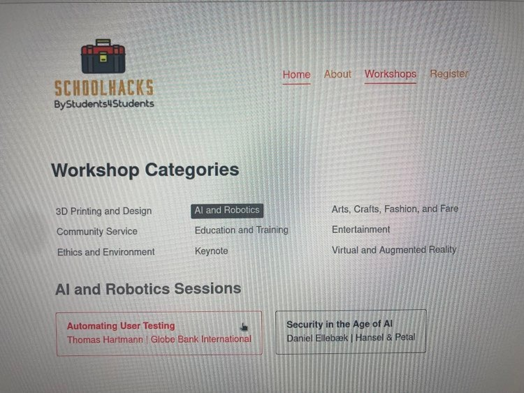

# React Router Version 6
#### lesson 06
***


### Description

1. A user-friendly app gives users visual feedback about the page they're currently visiting. One common approach
is to display an active link in a top navigation menu or sidebar, for example. For just that, React-Router provides
a component called NavLink, which you can use to change the appearance of a link when it's active. Let's use NavLink
in our site to set active links for the main navigation and the workshop link.
The NavLink component gives you a few options to style the rendered element when it's path matches the current URL.
   - Open the Workshops component and replace the Link import with the NavLink import. Also Replace the Link tag with the newly
   imported NavLink. Inspect the NavLink in the browser's developer tool. Apart from the \<a> tag you will find a class called "active".
   This class will only show if the link is active. With that you can style you NavLink component.
   - In the NavLink tab, try to style the component with a ternary operator. If active, style the link color like this, 
   if not, style the color link differently.
   - Ok, now you know how to do this. Replace the NavLink style option with className. Here you do the same as above but, instead of changed
   the color we change the className. If active use the className="workshop-active" otherwise set it to null.
2. Go into the Header component, and change all Link's tags, apart from the image Link tag to NavLink's. 
3. In the Header component right above the return statement, include this line of code:

```JS
  const getClass = ({ isActive }) => (isActive ? "nav-active" : null);
```

4. Add className={getClass()} in each NavLink component.


### Browser Image

<figure>
    
    <figcaption>NavLink's</figcaption>
</figure>

### Hints
- style={({ isActive })} => ({})
- condition ? doSomething : orDoSomethingElse


