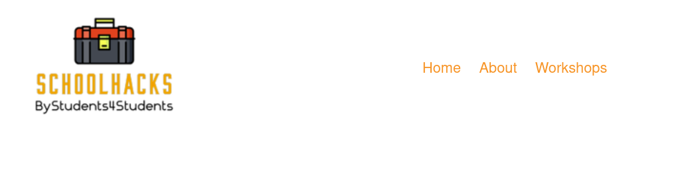
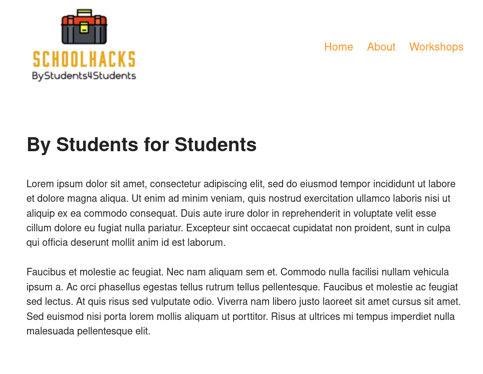
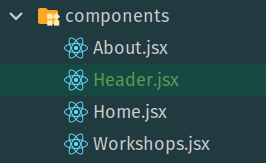

# React Router Version 6

#### lesson 02

***

### Description

1. Instead of writing the url manually in the url field, we would like to do this by a simple mouse click.
    - Between the nav tag in the main.jsx component, place a Link that points to the workshops path.
2. Now do the same with the Home and About component.
3. We also want to be able to click on the SchoolHacks logo, so we can easily return to the Home component.
4. The Header tag fills too much in our main file.
    - export the header in a **Header** component and then import the component back in the main file.

### Browser Image

<figure>
    
    <figcaption><em>Link Headers</em></figcaption>
</figure>

<figure>
    
    <figcaption><em>About Page</em></figcaption>
</figure>

<figure>
    
    <<figcaption><em>Components</em></figcaption>
</figure>

### Hints

- Link
- to=""

