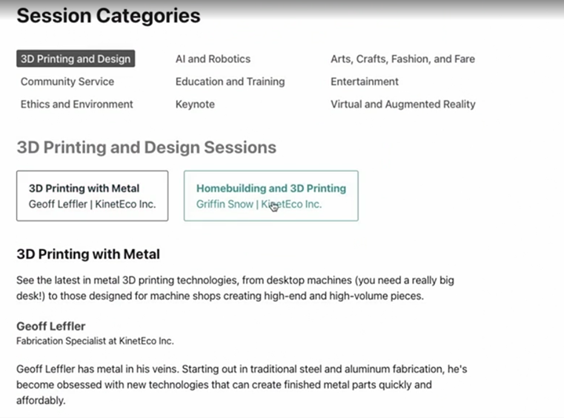

# React Router Version 6
#### lesson 07
***

### Description

1. Now you're going to use all that you have learned in the previous section to archive the following:
   - our goal is, to show each workshop session information below the workshop link in the browser.
   - see the image below
   - use the newly added Session component to archive just that.

### Browser Image

<figure>
    
    <figcaption>Session Information</figcaption>
</figure>

### Hints
- you need to add another nested route in the main.jsx file.
- study closely the Session component, Specially the useParam() hook.

