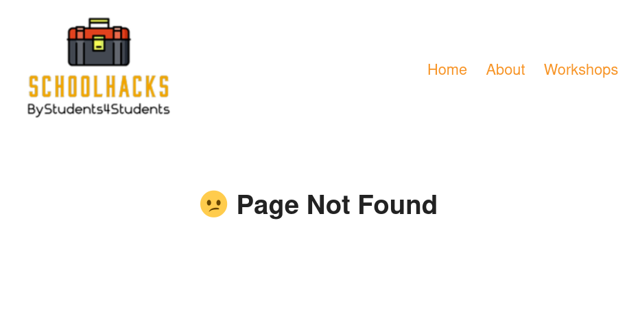

# React Router Version 6
#### lesson 03
***

### Description

1. When we click on the Workshops link now, we get presented with all workshops that are available to os. 
Now we would like to be able to click on each individual workshop to get some information what the workshop is all 
about. But we would like to see that information not on a different page but instead underneath the list of workshops. 
Here we can use something call **nested routes**.
   - create a nested route that points to **workshops/workshop** and injects the element component **Workshop**.
   - remember that a nested route is relative to his parent route!
   - remember to import and place the Outlet tag in the workshops component,
   - now if you enter the url **localhost:yourPort/workshops/workshop**, you should get the image shown below called **Workshop Sessions**.
2. if you try to enter a not valid url, like **localhost:yourPort/workshops/banan**, nothing happens. That is not very user-friendly.
We would like to create some sort of feedback to the user, so the user is aware of the wrong entered url.
    - create a route, that will take all the path's that are none existing and show the user an error message.
    - you can do that in two ways. The first one is to create an Error component, or you simply inject an error message into the route.
    - (optional) use the className="not-found" for styling the component.

### Browser Image

<figure>
    
    <figcaption>Workshop Sessions</figcaption>
</figure>

***

<figure>
    
    <figcaption>Error Page</figcaption>
</figure>

### Hints
- \<Route>\<Route>\</Route>\</Route>
- \<Outlet/> = is used for displaying the components children (nested routes).
- path="*"

