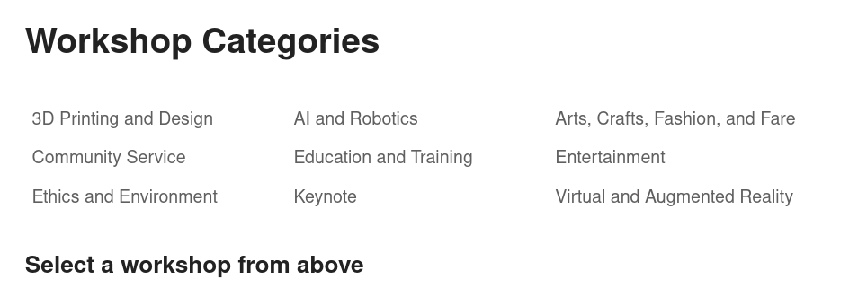

# React Router Version 6
#### lesson 08
***


### Description

1. Index Routes
   - if we click on the Workshops Header link, the space after our list of workshop categories
   is empty. Here we can use something called index routing. The index route will render when we 
   haven't clicked on any sessions links.
   - insert the code below in the main.jsx file in the comment "insert here"

```JS
 <Route index element={<h3>Select a workshop from above</h3>}/>
```
   - go back to the browser and see what is happening.
2. Sometimes you need to navigate users or change the URL programmatically. After
   for example a user submits a form or updates specific data in you app, like creating
   or deleting a profile or some other record, like a blog post for instance. React-Router uses the useNavigate() hook 
   for just that. Have a look at the newly added Register component. There you will find a form, where we ask the user 
   for his email. The input value we get from Reacts useRef() hook. The idear here is that we want the user to 
   submit the form and then to show him a conformation page.
   - Add the Register component into the Header component
   - Add a new route pointing to the newly added Confirmation component. path="confirmed"
   - In the Register component you have to figure out how to navigate the user to the Confirmation page.

### Browser Image

<figure>
    
    <figcaption>Index Route</figcaption>
</figure>

### Hints
- const navigate = useNavigate();
- handleSubmit()


