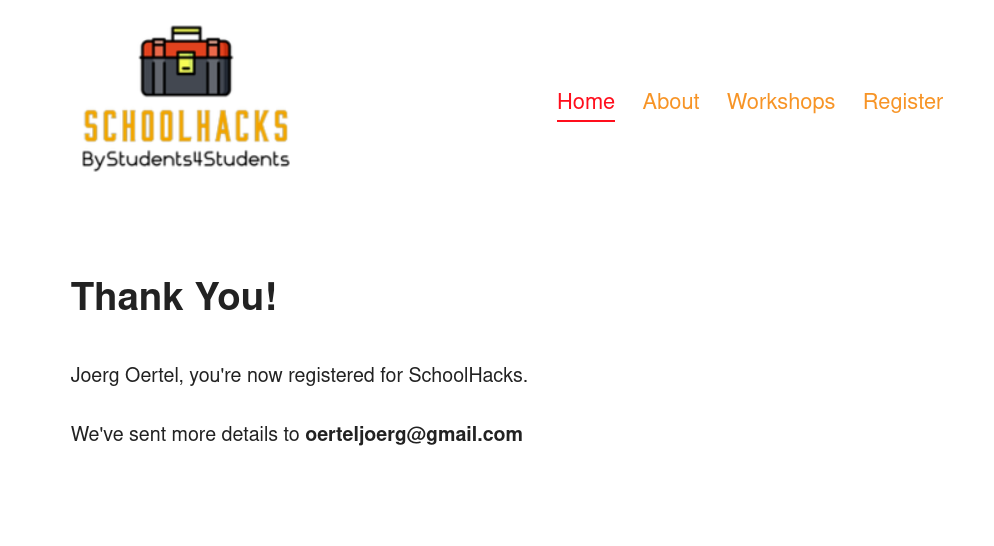

# React Router Version 6
#### lesson 09
***

### Description

1. In the Register component add two more input fields. First Name and Last Name. 

You can inject two params into the useNavigate() hook. The first one is the path you want to navigate to, 
and the other one is a state object. That means you are able to transfer an object to the location of the first param.

2. Use that knowledge to catch the state in the Confirmation component. To catch the state you will need to use
another hook from "react-router-dom"

3. After you have accessed that data in the confirmation component, it would be beneficial to the user if the confirmation
page were more personalized. Like displaying the user's email or other information. 
   - include the full name and email into the confirmation message.

### Browser Image

<figure>
    
    <figcaption>Confirmation</figcaption>
</figure>

### Hints
- useLocation();
- useRef();

