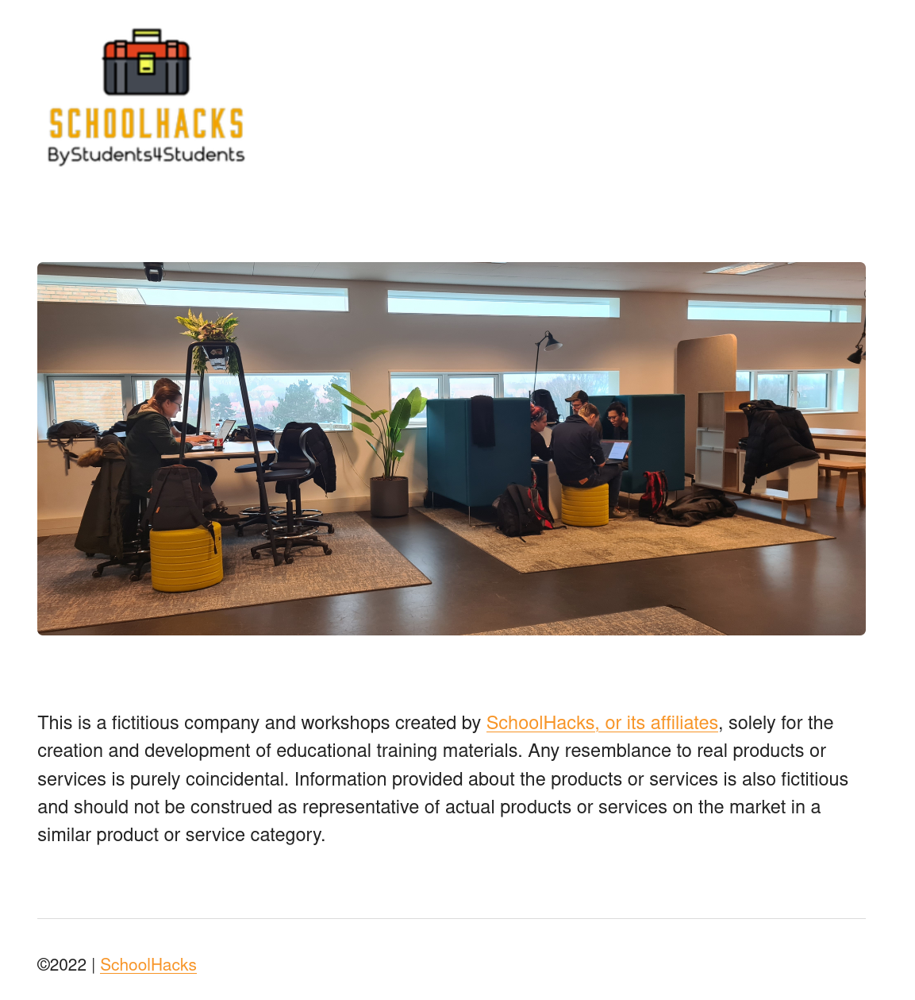
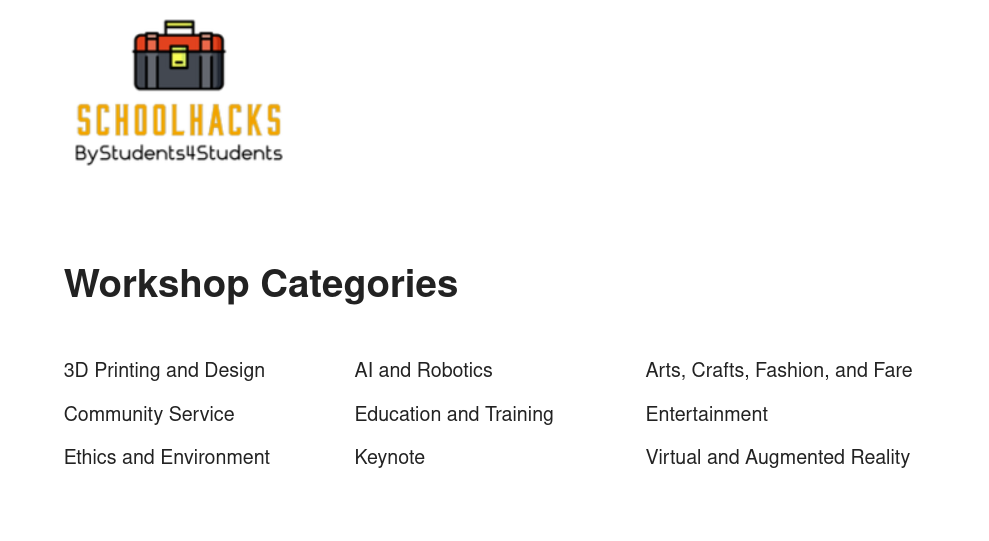

# React Router Version 6
#### lesson 01
***

### Description

1. install react-router-dom
2. connect to the browser's url in the main.jsx file
3. create your first route with the **Home** component as the element. The Home component needs props. Make sure to inject them through your route tag.
4. create another route, this time for the **Workshops** component
5. in the **Workshops** component, import the getWorkshops function from the api.js file.
6. loop through the data, you received from the getWorkshops function, to create a list that shows all workshop names from the dataset. 
Place the list right under the heading. Remember that each list needs a unique key!

### Browser Image

<figure>
    
   <figcaption><em>Homepage</em></figcaption>
</figure>
<figure>
    
    <figcaption><em>Workshops page</em></figcaption>
</figure>

### Hints

- BrowserRouter
- Routes
- Route
- map()
- \<ul>\</ul\>
- \<li>\</li\>

